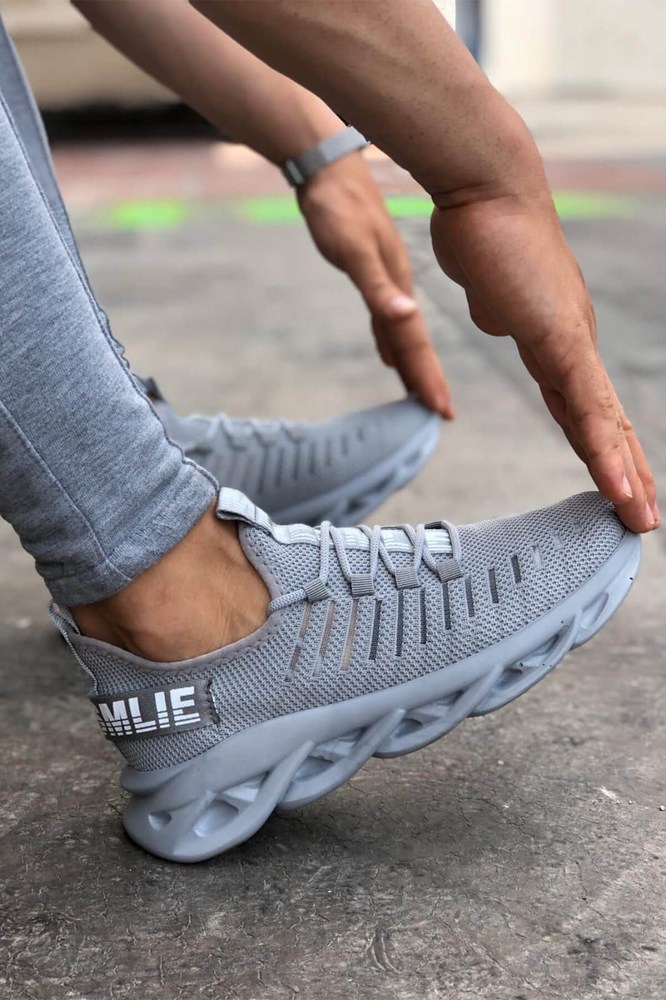

# webtasarimvize.github.io
<!doctype html>
<html lang="tr">
  <head>
      
    <meta charset="utf-8">
    <meta name="viewport" content="width=device-width, initial-scale=1, shrink-to-fit=no">
    <title>Semih Akbaş</title>

    <link rel="stylesheet" href="https://maxcdn.bootstrapcdn.com/bootstrap/4.0.0/css/bootstrap.min.css" integrity="sha384-Gn5384xqQ1aoWXA+058RXPxPg6fy4IWvTNh0E263XmFcJlSAwiGgFAW/dAiS6JXm" crossorigin="anonymous">
  
  </head>
  <body>
    
 
   
   

 

   
  <a><h1 class=class="display-4 ustb" >&nbsp;Akbashoes</h1></a>
 
</nav>
 

          
          

    

    
    
    
    

    

      
      <h1 class="display-4 ustb">&emsp;&emsp;&emsp;
Ayakkabıların renkli dünyası 

&emsp;&emsp;&emsp;
Akbashoes'a hoş geldiniz..</h1>
      
    

    

      
      

  

    
    

      <h5 class="card-title">YAZLIKLAR</h5>
      
Yazlık ayakkabılarımızda %50'ye varan indirim!!

     
    

  

  

    
    

      <h5 class="card-title">KIŞLIKLAR</h5>
      
Kışlık ayakkabılarımızda ikinci ürün yalnızca 10 TL!!

   
    

  

  

    
    

      <h5 class="card-title">SPOR AYAKKABILAR</h5>
      
Spor ayakkabılarında tek fiyat "200 TL"

     
    

  

      
    
  
  

      
      

  

    
    

      <h5 class="card-title">KLASİKLER</h5>
      
Özel günlerinizde klasiklerimiz sizlerle..

     
    

  

  

    
    

      <h5 class="card-title">KALIN TABANLILAR </h5>
      
Kalın tabanlılarda rahatlığın zirvesine çıkın.

   
    

  

  

    
    

      <h5 class="card-title">GÜNLÜK AYAKKABILAR</h5>
      
Gün içinde giyime uygun sokak tarzı ürünler.

     
    

  

      
    
  
  
  

  </body>
</html>
